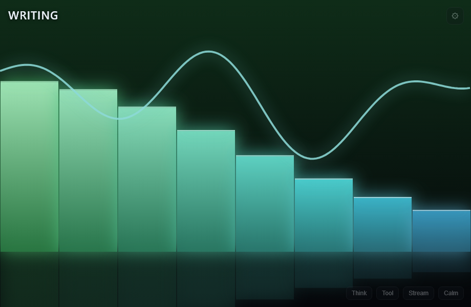
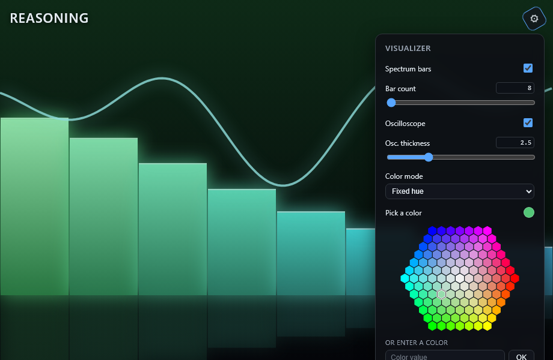

# Copilot Visualizer

A Winamp / Windows Media Player–style **spectrum + oscilloscope visualizer** for the
GitHub Copilot App. Instead of reacting to an audio signal, it pulses and glows in
response to **live agent activity** — reasoning, tool calls, streaming output — so you
get an ambient, at-a-glance sense of what the agent is doing.

It ships as a [GitHub Copilot App **canvas extension**](https://docs.github.com/en/copilot/how-tos/github-copilot-app/working-with-canvas-extensions#about-canvas-extensions):
a small Node process that declares a canvas to the runtime and serves an animated
`<canvas>` renderer into the side panel.



## Features

- **Reactive spectrum bars + oscilloscope** drawn at 60 fps, with glow, reflection,
  and energy that rises on activity and decays toward calm between events.
- **Activity-driven color.** Each kind of work gets its own hue — reasoning (violet),
  tool use (green), streaming (amber), speaking (orange), idle (blue) — and the
  current activity is labeled in the corner.
- **Settings panel** (gear, top-right) to tailor the look:
  - Show / hide the spectrum and/or the oscilloscope independently.
  - **Bar count** (8–256) and **oscilloscope thickness** (0.5–8) via slider *or* a
    typed numeric box with the same bounds.
  - **Color mode** — follow the live activity hue, or lock a fixed color.
  - A Winamp-style **honeycomb color wheel** plus an "enter a color" field
    (named colors, `#rgb` / `#rrggbb`, `rgb()` / `rgba()`).
  - Preferences persist globally for the extension.
- **Agent actions** so the assistant (or a script) can drive it directly:
  - `pulse` — raise/lower energy and set the current activity (great for demos).
  - `reset` — calm it back to idle.
  - `configure` — update any appearance setting (partial updates merge).



## How it works

The extension follows a **functional core / imperative shell** design:

| File | Role |
| --- | --- |
| `viz-core.mjs` | **Pure core** — all the animation/settings/color math (`classifyEvent`, `applyImpulse`, `decay`, `computeBars`, `normalizeSettings`, `coerceNumericSetting`, the color-wheel helpers, …). No Node, no DOM, no imports. Unit-tested with `node:test` and reused **verbatim** in three places. |
| `extension.mjs` | **Imperative shell** — subscribes to live session events, folds them into a single `VizState`, and runs one loopback HTTP server per canvas instance (serving the iframe HTML, the core module, an SSE stream, and the settings endpoints). |
| `client.html` | **Renderer** — the `<canvas>` element + 60 fps loop. Imports the *same* core, decays energy locally between SSE syncs, and draws the bars + oscilloscope. |

Because the core is a single dependency-free module, the exact same logic runs under the
Node test runner, inside the extension process, and inside the browser iframe.

## Install

This is a GitHub Copilot App extension, so installing it means placing the folder where the GitHub Copilot App 
discovers extensions and reloading.

1. Copy this `copilot-visualizer/` directory into your Copilot extensions folder:

   - **User scope** (just you): `~/.copilot/extensions/copilot-visualizer/`
     (on Windows: `%USERPROFILE%\.copilot\extensions\copilot-visualizer\`).     
   - **Project scope** (committed, shared with a repo): `.github/extensions/copilot-visualizer/`
     relative to the git root.

2. Reload extensions in the GitHub Copilot App, then open the Copilot Visualizer canvas.

## Build & run locally / Contributing

There's no build step — the extension is plain ES modules. Development is mostly: edit a
file, run the tests, reload, and verify in the canvas.

### Prerequisites

- Node.js 20.19 or newer.
- The GitHub Copilot app canvas / UI-extensions enabled

### Run the tests

The pure core is fully unit-tested with the built-in Node test runner — no test framework
to install:

```sh
cd copilot-visualizer
node --test
```

You should see all suites pass (currently **55** tests across `tests/viz-core.test.mjs`,
`tests/settings-core.test.mjs`, `tests/color-wheel-core.test.mjs`, and
`tests/numeric-input-core.test.mjs`). `node --test` discovers them recursively, so the
command works from the extension root.

To syntax-check a file without running it: `node --check extension.mjs`.

### Development conventions

This project follows two rules strictly — please keep to them in PRs:

- **Functional core / imperative shell.** New logic (math, validation, transforms) goes in
  the pure `viz-core.mjs` so it can be tested in isolation. `extension.mjs` and
  `client.html` stay thin — wiring, I/O, and rendering only.
- **Test-Driven Development.** Write a **failing** `node:test` case in the matching
  `tests/*-core.test.mjs` file *before* the implementation, then make it green. The shell and
  iframe are verified through the canvas RPC checklist (open the canvas, invoke an action,
  check the rendered result) since DOM/iframe rendering isn't observable from the test
  runner.

### Iterating on the extension

- Editing **`client.html`** only: the HTML is served fresh on every request, so just
  re-open (focus) the canvas to reload the iframe — no extension reload needed.
- Editing **`extension.mjs`** or **`viz-core.mjs`**: run `extensions_reload` so the
  provider restarts with the new code.
- **Never `console.log`** from `extension.mjs` — stdout is reserved for the JSON-RPC
  protocol and logging there corrupts it. Use `session.log(...)` instead; the extension's
  log file is the place to look when something fails to load.

### File layout

```
copilot-visualizer/
├── extension.mjs               # imperative shell: events → state → HTTP/SSE + actions
├── viz-core.mjs                # pure core: animation, settings, and color math
├── client.html                # <canvas> renderer (imports the same core)
├── tests/                      # node:test suites for the pure core (*-core.test.mjs)
├── assets/                     # screenshots used by this README
├── artifacts/                  # runtime-written settings (created on first save)
├── copilot-extension.json      # manifest (enables gist share/install)
├── LICENSE
└── README.md
```

## License

Released under the [MIT License](LICENSE) — © 2026 Jason Tucker. Permissive and free to
use, modify, and redistribute, provided the copyright notice and license text are retained.
